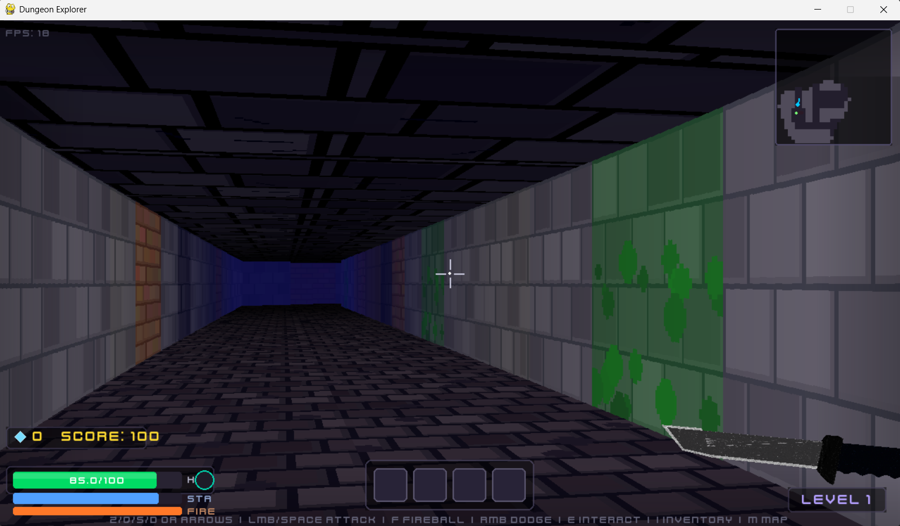

# Dungeon Explorer

A 2.5D first-person dungeon crawler built entirely in Python using `pygame-ce`. It uses a custom software raycasting engine (accelerated by `numpy`) to render textured 3D environments, complete with sprite billboards generated dynamically from 3D models.



## Features

* **Custom 2.5D Raycasting Engine:** Fast, numpy-accelerated software rendering with floor/ceiling casting, distance fog, and dynamic torch lighting.
* **Procedural Generation:** Infinite randomized dungeon levels with distinct room types (Crypt, Library, Armory), connecting corridors, and hidden secret rooms.
* **Advanced Game Feel:** Implements screen shake, head-bobbing, hit-stop frames, and critical hits to make combat feel visceral and heavy.
* **3D-to-2D Asset Pipeline:** Enemies, crystals, and weapons are 3D `.glb`/`.obj` models that the engine dynamically pre-bakes into animated 2D sprite sheets on startup.
* **Smart Enemy AI:** Monsters patrol, chase, and attack using different behaviors (e.g. Brutes throw projectiles from afar, Crawlers swarm up close).
* **Fog of War:** A dynamic minimap that only reveals the dungeon as you explore it, and only shows nearby enemies.
* **Procedural Audio:** Synthesized ambient soundscapes (echoing drips, howling winds) alongside a full suite of Kenney asset sound effects.
* **Polished UI:** Animated main menu, interactive settings panel (with live volume and mouse sensitivity sliders), and a sleek HUD.

## Controls

* **W, A, S, D** - Move
* **Mouse** - Look around
* **Left Click** - Attack (Hold to charge a heavy attack)
* **Right Click** / **Space** - Dodge roll
* **E** - Interact (Open/Close doors, Pick up items)
* **1-9** - Use inventory item (e.g., Health Potion)
* **ESC** - Return to Title Menu / Pause

## Requirements

This game requires Python 3.10+ and a few external libraries.

* `pygame-ce` (Community Edition - much faster than standard pygame)
* `numpy` (For raycasting math)
* `trimesh`, `pyrender`, `pyglet` (For 3D model baking)
* `scipy` (For model rendering)
* `Pillow` (For image processing)

## Installation & Running

1. Clone the repository.
2. It's recommended to create a virtual environment:
   ```bash
   python -m venv .venv
   ```
   * Activate on Windows: `.venv\Scripts\activate`
   * Activate on Mac/Linux: `source .venv/bin/activate`
3. Install the dependencies:
   ```bash
   pip install -r requirements.txt
   ```
4. Run the game!
   ```bash
   python main.py
   ```

## Development

The codebase is heavily modularized:
* `main.py` - Game loop, state management, and input handling.
* `raycaster.py` - Core 3D software rendering engine (walls, floors, ceilings).
* `dungeon_map.py` - Procedural generation logic (rooms, corridors, secrets).
* `player.py` - Player physics, combat logic, and camera shake.
* `sprites.py` - Enemy AI and interactive world items.
* `model_renderer.py` - The 3D-to-2D baking pipeline.
* `hud.py` & `menu.py` - User interface.
* `sound_manager.py` - Audio playback and procedural ambience synthesis.

## Credits

* Code & Engine: Written by Amine-te.
* Assets: Textures and sounds sourced from [Kenney.nl](https://kenney.nl/).
